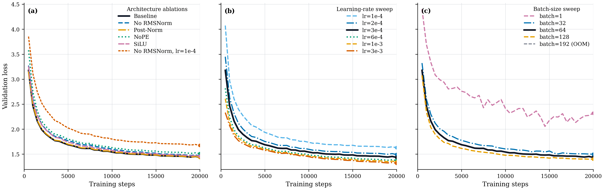
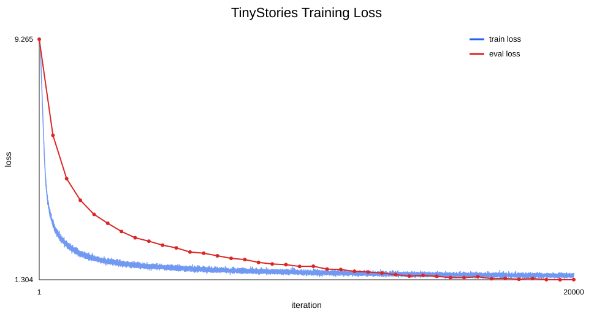
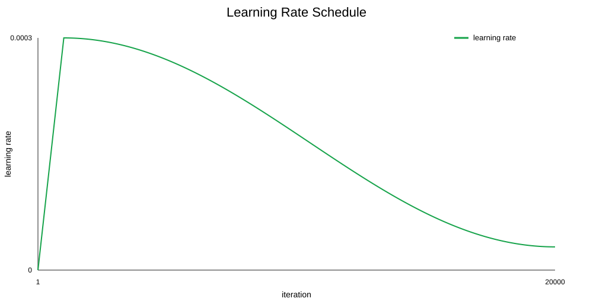
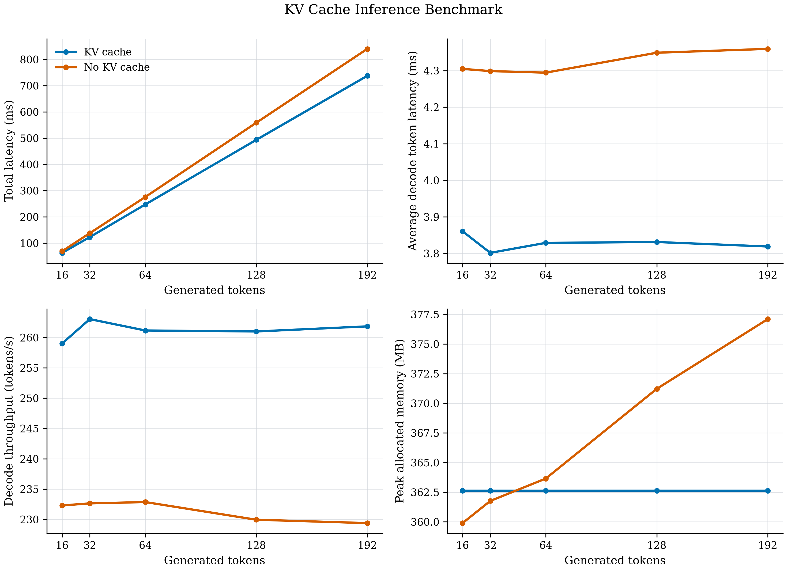

# Pretraining a Language Model from Scratch

> 从 byte-level BPE 到文本生成的 decoder-only language model

本项目实现并预训练了一个约 17M 参数的 decoder-only language model。训练数据为 TinyStories，训练链路包含 tokenizer 训练、数据编码、模型训练、验证、checkpoint 保存和文本生成。

项目参考 Stanford **CS336 Spring 2025 Assignment 1: Basics**，并记录了架构消融、学习率 sweep、batch size sweep、BPE 性能分析和生成结果。

## 项目概览

| 项目 | 当前配置 |
| --- | --- |
| 训练任务 | Causal language modeling / next-token prediction |
| 训练语料 | TinyStories V2 GPT-4 train/validation split |
| Tokenizer | GPT-2 风格 byte-level BPE |
| 词表 | 10,000 tokens，9,743 条 merge rules |
| 模型规模 | 约 17M 参数 |
| Transformer | 4 layers，16 heads，`d_model=512`，`d_ff=1344` |
| 上下文长度 | 256 tokens |
| 基线结构 | Pre-Norm + RMSNorm + RoPE + SwiGLU |
| 优化器 | 手写 AdamW，weight decay `0.01` |
| 学习率 | warmup + cosine decay，基线 peak lr `3e-4` |
| 训练协议 | 20,000 optimizer steps，每 500 步验证一次 |
| 生成策略 | temperature sampling + top-p sampling |
| 主要实验设备 | NVIDIA RTX 3090 24 GB |

## 从原始文本到生成文本

```text
TinyStories 原始文本
        |
        v
GPT-2 regex pre-tokenization
        |
        v
Byte-level BPE 训练 -> vocab.json / merges.txt
        |
        v
文本编码 -> train.bin / valid.bin
        |
        v
Embedding -> Causal Self-Attention + RoPE -> SwiGLU FFN
        |                         （重复 4 层）
        v
RMSNorm -> LM Head -> next-token logits
        |
        v
AdamW + gradient clipping + warmup/cosine decay
        |
        v
Checkpoint -> temperature/top-p generation
```

## 核心实现

### Tokenizer

- 从 256 个基础 byte token 开始训练 byte-level BPE。
- 使用 GPT-2 风格正则完成 pre-tokenization，并保留单词前的空格信息。
- 在统计频率前隔离 `<|endoftext|>` 等 special tokens。
- 使用倒排索引定位受 merge 影响的词，避免每次合并扫描全部词表。
- 按“频率优先、字典序打破平局”的规则选择下一个 pair。

相关实现位于 [`train_bpe.py`](./cs336_basics/train_bpe.py)、[`tokenizer.py`](./cs336_basics/tokenizer.py) 和 [`prepare_data.py`](./cs336_basics/prepare_data.py)。

### Transformer language model

模型的主要模块均在 [`nn.py`](./cs336_basics/nn.py) 中由 PyTorch tensor 操作实现：

- token embedding 和线性层；
- causal scaled dot-product attention；
- Rotary Position Embedding（RoPE）；
- RMSNorm，以及可切换的 Pre-Norm / Post-Norm；
- SwiGLU 和 SiLU feed-forward network；
- Transformer block、最终归一化和 language-model head；
- 数值稳定的 cross-entropy loss。

### 训练与生成

- [`optimizer.py`](./cs336_basics/optimizer.py)：AdamW、gradient clipping 和 cosine learning-rate schedule；
- [`train.py`](./cs336_basics/train.py)：训练、验证、checkpoint 和 JSONL 指标记录；
- [`run_train_tinystories.py`](./cs336_basics/run_train_tinystories.py)：基线与消融实验入口；
- [`generate.py`](./cs336_basics/generate.py)：temperature 和 top-p 采样；
- [`run_generate_tinystories.py`](./cs336_basics/run_generate_tinystories.py)：从 checkpoint 生成 TinyStories 文本。

## 实验结果

受控基线使用 seed `42`、batch size `64`、peak learning rate `3e-4`，最终验证集 loss 为 **1.4360**，对应 PPL **4.2039**。除特别说明外，实验都训练 20,000 steps。

### 架构消融

| 设置 | 最终验证集 loss | PPL | 相对基线 |
| --- | ---: | ---: | ---: |
| Baseline：Pre-Norm + RMSNorm + RoPE + SwiGLU | **1.4360** | **4.2039** | 0.0000 |
| No RMSNorm | 1.4655 | 4.3297 | +0.0295 |
| Post-Norm | 1.4357 | 4.2024 | -0.0004 |
| NoPE | 1.5091 | 4.5224 | +0.0730 |
| SiLU FFN | 1.4582 | 4.2983 | +0.0222 |

在当前配置和计算预算下，移除 RoPE 的退化最明显；移除 RMSNorm 也会损害结果。Post-Norm 与 Pre-Norm 几乎持平，这个结果对应当前 seed 和训练预算。SwiGLU 相比普通 SiLU FFN 略有优势。

### 超参数实验

| 实验维度 | 最佳已测试设置 | 最终验证集 loss | 结论 |
| --- | --- | ---: | --- |
| Peak learning rate | `3e-3` | **1.3171** | 在已测试范围内持续改善，尚未覆盖发散边界 |
| Batch size | `128` | **1.4007** | 是当前成功完成的最大 batch |
| 显存上限探测 | `192` | - | 在第 1 步 OOM |

学习率 sweep 的结果在测试范围内呈单调改善。`3e-3` 尚未发散，教案要求的 divergent run 仍待补充。Batch size sweep 固定了 optimizer steps，较大 batch 同时处理了更多训练 token，这组结果无法单独估计 batch size 的影响。

完整运行名称、loss、PPL、耗时和状态见 [`EXPERIMENT_LOG.md`](./EXPERIMENT_LOG.md) 与 [`ablation_results_table.md`](./outputs/tinystories_ablations/ablation_results_table.md)。

## 训练曲线

三联图展示了架构、学习率和 batch size 三组实验的 loss 曲线，可以直接比较下降速度和最终水平。



*三组消融实验的验证集 loss 曲线。每条曲线均来自对应运行目录的 `metrics.jsonl`。*

基线运行的训练 loss、验证 loss 和学习率曲线：

<p align="center">
  
  
</p>

## BPE 性能分析

在完整 TinyStories 训练文本上，当前 BPE 实现完成 9,743 次 merge 的资源测量如下：

| 指标 | 结果 |
| --- | ---: |
| 输入文本 | 2,227,753,162 bytes |
| 墙钟时间 | 14:28.24 |
| CPU 利用率 | 99% |
| 峰值 RSS | 11,381,472 KiB（约 10.85 GiB） |
| 训练集编码后 token 数 | 540,796,778 |
| 验证集编码后 token 数 | 5,461,210 |
| 最长 token | ` accomplishment`，15 个 UTF-8 bytes |

端到端运行中，预分词和原始计数构建约占 94% 的墙钟时间；merge 阶段的主要热点是遍历 `stats` 字典选择最高频 pair。详细数据和分析见 [`PROFILE_REPORT.md`](./profile_output/PROFILE_REPORT.md)。

## 文本生成示例

基线 checkpoint 在第 20,000 次迭代生成了下面的 TinyStories 续写。设置为 prompt `Hello, she said`、temperature `0.8`、top-p `0.9`、seed `42`：

> Hello, she said, "Hi, I am Lily. Do you want to play with me?" The snake said, "Yes, I want to play too!"
>
> Lily and the snake played all day. They ran, jumped, and laughed. But then, something unexpected happened. The snake changed into a big, friendly dog! The dog said, "I am a magic dog. I can make your wishes come true." Lily was so surprised and happy. She wished for a big ice cream cone. The magic dog made her wish come true.

模型在生成 `<|endoftext|>` 后正常停止，共生成 113 个 token（包含 prompt）。完整文本保存在 [`generated_sample.txt`](./outputs/tinystories_base/generated_sample.txt)，生成设置和分析见 [`generation_report.md`](./outputs/tinystories_base/generation_report.md)。

## KV cache 推理性能

生成时，prompt 经过一次完整前向后保存每层注意力的 K/V。上下文窗口未满时，后续 token 只计算新 token 的 Q/K/V，并读取历史 K/V；窗口满后重新建立最近窗口的 cache。`generate.py` 默认开启 KV cache，加入 `--no-kv-cache` 可以切换到全量重算路径。

基于 baseline checkpoint，在 RTX 3090 上使用 prompt `Hello, she said` 和贪心解码进行对比。每个生成长度先 warmup 2 次，再正式测量 3 次，两个路径输出的 token 序列全部一致。



| 生成 token 数 | KV cache 吞吐 (token/s) | 无 cache 吞吐 (token/s) | 总耗时加速比 |
| ---: | ---: | ---: | ---: |
| 16 | 259.02 | 232.30 | 1.10x |
| 32 | 263.04 | 232.64 | 1.12x |
| 64 | 261.17 | 232.86 | 1.12x |
| 128 | 261.01 | 229.95 | 1.13x |
| 192 | 261.85 | 229.39 | 1.14x |

完整的 JSON 数据、PNG/PDF 图片和中文报告分别保存在 `outputs/tinystories_base/` 与 `profile_output/kv_cache_benchmark.md`。重新运行基准测试：

```bash
CUDA_VISIBLE_DEVICES=6 uv run python scripts/benchmark_kv_cache.py
```

## 快速开始

### 环境

项目使用 `uv` 管理 Python 环境，要求 Python `>=3.11`：

```bash
uv sync
```

运行单元测试：

```bash
uv run pytest
```

### 数据与 tokenizer

当前训练入口默认从 `/data/leejt/cs336_assignment1/data` 读取课程数据，并将 tokenizer 和 tokenized data 放在该目录下。准备数据后可以运行：

```bash
uv run python cs336_basics/train_bpe.py
uv run python cs336_basics/prepare_data.py
```

这两个脚本会生成：

```text
/data/leejt/cs336_assignment1/data/
├── TinyStoriesV2-GPT4-train/
│   ├── vocab.json
│   └── merges.txt
└── TinyStoriesV2-GPT4-tokenized/
    ├── train.bin
    ├── valid.bin
    └── metadata.json
```

原始数据下载方式和课程任务说明保留在 [`cs336_spring2025_assignment1_basics.pdf`](./cs336_spring2025_assignment1_basics.pdf) 中。

### 训练基线

```bash
CUDA_VISIBLE_DEVICES=0 uv run python -u cs336_basics/run_train_tinystories.py \
  --experiment baseline \
  --run-name tinystories_base \
  --run-root /data/leejt/cs336_assignment1/runs
```

训练过程会在 run directory 中写入 `config.json`、`metrics.jsonl` 和 `checkpoint.pt`。架构消融使用 `--experiment` 指定，例如：

```bash
CUDA_VISIBLE_DEVICES=0 uv run python -u cs336_basics/run_train_tinystories.py \
  --experiment nope \
  --run-name tinystories_nope \
  --run-root /data/leejt/cs336_assignment1/runs
```

当前已经完成的 GPU 队列脚本位于 [`run_gpu6_remaining_experiments.sh`](./scripts/run_gpu6_remaining_experiments.sh)。

### 文本生成

```bash
uv run python cs336_basics/run_generate_tinystories.py \
  --prompt "Hello, she said" \
  --temperature 0.8 \
  --top-p 0.9 \
  --output-path outputs/tinystories_base/generated_sample.txt
```

## 仓库结构

```text
.
├── cs336_basics/
│   ├── train_bpe.py              # byte-level BPE 训练
│   ├── tokenizer.py              # tokenizer 编解码
│   ├── prepare_data.py           # 文本编码与二进制数据准备
│   ├── nn.py                     # Transformer LM 组件
│   ├── optimizer.py              # AdamW、梯度裁剪、学习率调度
│   ├── train.py                  # 训练与验证循环
│   ├── generate.py               # temperature/top-p 生成与 KV cache
│   ├── run_train_tinystories.py  # TinyStories 训练入口
│   └── run_generate_tinystories.py
├── outputs/
│   ├── tinystories_base/         # 基线曲线、生成样例与 KV cache 性能图
│   └── tinystories_ablations/    # 消融曲线、结果表与绘图脚本
├── profile_output/               # BPE 与 KV cache 性能分析报告
├── scripts/
│   ├── benchmark_kv_cache.py     # KV cache 推理性能基准
│   └── run_gpu6_remaining_experiments.sh
├── tests/                        # 单元测试与 reference snapshots
├── EXPERIMENT_LOG.md             # 汇总实验日志
└── cs336_spring2025_assignment1_basics.pdf
```

## 当前边界与后续计划

- 当前完整实验集中在 TinyStories 和约 17M 参数的模型上。OpenWebText 的完整训练结果尚未加入。
- 消融和 sweep 目前主要使用单个 seed；差异很小的结论需要多 seed 重复确认。
- 学习率 sweep 尚未覆盖真正发散的设置。
- Batch size 对比需要在匹配 token budget 的协议下补充，以便把 batch size 影响与训练 token 数影响分开。
- 后续可以继续补充 OpenWebText tokenizer 对比、语言模型训练和更系统的生成质量评估。

## 参考课程

实现参考 Stanford CS336 Spring 2025 Assignment 1: Basics 的课程代码结构、测试和教案。课程 handout 保留在仓库中，实验日志、分析报告和结果图记录本项目的实现结果。仓库许可信息见 [`LICENSE`](./LICENSE)。
